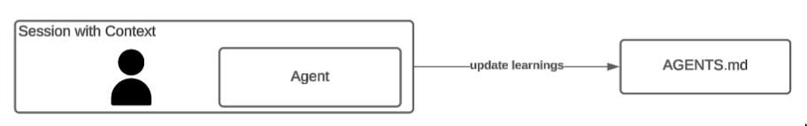
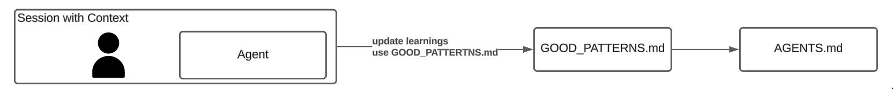
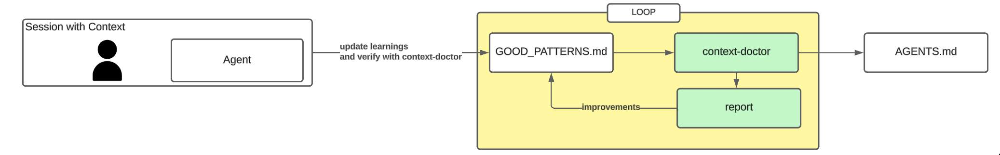
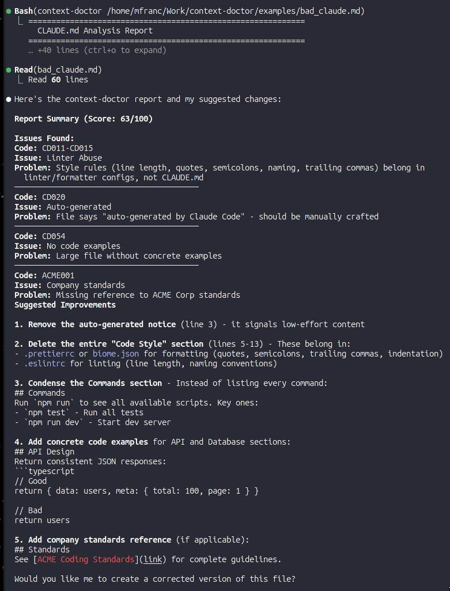

<p align="center">
  
</p>

# context-doctor

A CLI tool that analyzes CLAUDE.md files and provides feedback on best practices for Claude Code context management.

## Why this matters

When working with AI coding agents, your context grows throughout a session. It's tempting to tell the agent to update your CLAUDE.md/AGENTS.md with learnings so future sessions start with a better foundation. But this often leads to bloated files with conflicting instructions.

Your initial CLAUDE.md instructions are **critical** for two reasons:

1. **Instruction count affects performance** - LLMs can reliably follow ~150-200 instructions. Claude Code's system prompt already uses [~50 instructions](https://www.humanlayer.dev/blog/writing-a-good-claude-md) according to HumanLayer's analysis. Every instruction you add competes for attention, and as count increases, compliance decreases uniformly across all instructions.

2. **Position matters** - Due to the ["Lost in the Middle"](https://arxiv.org/abs/2307.03172) phenomenon, LLMs exhibit a U-shaped attention curve: they best recall information at the **beginning** and **end** of context, while information in the middle gets overlooked. Your CLAUDE.md sits at the beginning - make every line count.

context-doctor helps you maintain a lean, effective CLAUDE.md by detecting common anti-patterns before they degrade your agent's performance.

## The problem

There are three approaches to maintaining your CLAUDE.md:

### 1. Unsupervised agent updates

In the agentic world, we often just tell the agent "update CLAUDE.md with what you learned" or "create a CLAUDE.md for this project."



This leads to CLAUDE.md files that grow chaotically:
- Instructions get added but never removed
- Conflicting rules accumulate over time
- Generic advice dilutes project-specific guidance
- The file becomes a dumping ground for "lessons learned"

### 2. Using custom prompts

This can be mitigated with a [custom prompt for updating CLAUDE.md](https://www.aihero.dev/a-complete-guide-to-agents-md) as suggested by Matt Pocock - but that requires you to remember to use the prompt every time.



### 3. Using context-doctor (self-reinforcing loop)

context-doctor takes a different approach: it provides a standalone binary with predefined rules (based on research and best practices) that evaluates your CLAUDE.md, generates a report, and suggests specific changes.



You can tell the agent to use context-doctor itself, creating a self-reinforcing loop:

```
> Run context-doctor on CLAUDE.md and fix any issues it finds
```

The agent runs the analysis, reads the report, and applies fixes - all validated against the same rules. Run it periodically or add it to your CI pipeline to keep your CLAUDE.md healthy.

**Note:** This project is in early alpha. Rules and scoring are still being refined.

## Example Output



<details>
<summary>Text output</summary>

Analyzing a CLAUDE.md with issues:

```
============================================================
  CLAUDE.md Analysis Report
============================================================

File: examples/bad_claude.md

METRICS
----------------------------------------
  Lines:        60 (OK)
  Instructions: ~37 (+50 Claude = ~87) (OK)
  Progressive Disclosure: NO

LINTER ABUSE DETECTED
----------------------------------------
  ⚠ [CD011] Line length rules found
     → Use a linter for line length enforcement
  ⚠ [CD012] Quote style rules found
     → Use a formatter (Prettier, Biome) for quote style
  ⚠ [CD013] Naming convention rules found
     → Use a linter for naming conventions
  ⚠ [CD014] Semicolon rules found
     → Use a formatter for semicolon style
  ⚠ [CD015] Trailing character rules found
     → Use a formatter for trailing characters

AUTO-GENERATED CONTENT
----------------------------------------
  ⚠ [CD020] File appears to be auto-generated
     → CLAUDE.md is high-leverage. Carefully craft each line manually instead of using /init

OVERALL SCORE
----------------------------------------
  65/100
```

Analyzing a well-crafted CLAUDE.md:

```
============================================================
  CLAUDE.md Analysis Report
============================================================

File: examples/good_claude.md

METRICS
----------------------------------------
  Lines:        25 (OK)
  Instructions: ~6 (+50 Claude = ~56) (OK)
  Progressive Disclosure: YES

GOOD PRACTICES DETECTED
----------------------------------------
  ✓ [CD040] Progressive disclosure pattern detected

PROGRESSIVE DISCLOSURE REFERENCES
----------------------------------------
  - docs/architecture.md
  - docs/api-patterns.md
  - docs/testing.md

OVERALL SCORE
----------------------------------------
  95/100

  ✓ Excellent! Your CLAUDE.md follows best practices.
```

</details>

## Installation

### Download binary (recommended)

Download the latest release for your platform from [GitHub Releases](https://github.com/michal-franc/context-doctor/releases).

**Linux (amd64):**
```bash
curl -Lo context-doctor https://github.com/michal-franc/context-doctor/releases/latest/download/context-doctor-linux-amd64
chmod +x context-doctor
sudo mv context-doctor /usr/local/bin/
```

**Linux (arm64):**
```bash
curl -Lo context-doctor https://github.com/michal-franc/context-doctor/releases/latest/download/context-doctor-linux-arm64
chmod +x context-doctor
sudo mv context-doctor /usr/local/bin/
```

**macOS (Apple Silicon):**
```bash
curl -Lo context-doctor https://github.com/michal-franc/context-doctor/releases/latest/download/context-doctor-darwin-arm64
chmod +x context-doctor
sudo mv context-doctor /usr/local/bin/
```

**macOS (Intel):**
```bash
curl -Lo context-doctor https://github.com/michal-franc/context-doctor/releases/latest/download/context-doctor-darwin-amd64
chmod +x context-doctor
sudo mv context-doctor /usr/local/bin/
```

**Windows:**

Download `context-doctor-windows-amd64.exe` from [releases](https://github.com/michal-franc/context-doctor/releases) and add to your PATH.

### From source

Requires Go 1.21+.

```bash
git clone https://github.com/michal-franc/context-doctor.git
cd context-doctor
make build
```

### Install to system (requires sudo)

```bash
sudo make install
```

### Install to user directory (no sudo)

```bash
make install-user
```

Make sure `~/go/bin` is in your PATH.

## Usage

```bash
context-doctor [options] <path-to-CLAUDE.md | directory>
```

### Options

| Flag | Description |
|------|-------------|
| `-rules-dir` | Directory containing custom rules (default: same directory as CLAUDE.md) |
| `-no-builtin` | Disable built-in rules |
| `-verbose` | Show detailed output including passed checks |
| `-score` | Show overall score (default: true) |
| `-categories` | Filter by categories (comma-separated) |
| `-severities` | Filter by severities: error, warning, info (comma-separated) |
| `-stale-threshold` | Days before a referenced doc is considered stale (default: 90) |
| `-version` | Show version information |

### Example

```bash
# Analyze a single CLAUDE.md file
context-doctor ./CLAUDE.md

# Scan an entire repository
context-doctor .

# Verbose output with all checks
context-doctor -verbose ./CLAUDE.md

# Only show errors
context-doctor -severities error ./CLAUDE.md
```

### Repository mode

When you pass a directory, context-doctor finds all `CLAUDE.md` files (respecting `.gitignore`) and produces a consolidated repo report:

- Enforces a single `CLAUDE.md` per repo (multiple files = error with -30 score penalty)
- Validates referenced docs exist and aren't stale
- Recursively follows references (docs referencing other docs), with cycle detection
- Finds orphan `.md` files not referenced by any `CLAUDE.md`
- Detects duplicated instructions across the full file tree
- Shows aggregate metrics and per-file scores

### Primary vs referenced docs

context-doctor treats your CLAUDE.md and its referenced docs differently. CLAUDE.md-specific rules (line count limits, instruction count, missing project context, etc.) only run against the primary CLAUDE.md — not against referenced docs like README.md or docs/*.md. Referenced docs serve humans too, so only universal rules (like linter abuse detection) apply to them.

See [RULES.md](RULES.md) for which rules are primary-only.

### Using with Claude Code

You can ask Claude to analyze your CLAUDE.md and suggest improvements:

```
> Run context-doctor on my CLAUDE.md and suggest improvements

Running context-doctor...

Based on the analysis, here are my recommendations:

**Issues Found:**
1. [CD011-CD015] Linter abuse - Your CLAUDE.md contains formatting rules like
   "use 2 spaces for indentation" and "always use single quotes". These should
   be handled by tools like Prettier or ESLint, not Claude.

2. [CD020] Auto-generated content - The file appears to be from /init. Consider
   rewriting it to focus on your project's unique context.

**Suggested Improvements:**

1. Remove formatting rules and add a .prettierrc instead:
   { "singleQuote": true, "tabWidth": 2 }

2. Replace generic instructions with project-specific context:
   - What makes this codebase unique?
   - What patterns should Claude follow?
   - What mistakes should Claude avoid?

3. Add progressive disclosure for complex topics:
   - "For API patterns, see docs/api-patterns.md"
   - "For testing guidelines, see docs/testing.md"

Would you like me to help rewrite your CLAUDE.md?
```

## What it checks

- **Length issues** - File and line count thresholds
- **Instruction count** - Too many instructions reduce LLM compliance
- **Linter abuse** - Rules that should be handled by formatters/linters
- **Auto-generated content** - Detects `/init` generated files
- **Progressive disclosure** - Encourages linking to separate docs
- **Referenced docs** - Recursively validates referenced files exist and aren't stale
- **Cross-file consistency** - Detects duplicated instructions across the full reference tree
- **Repo-level checks** - Enforces single CLAUDE.md, finds orphan `.md` files

See [RULES.md](RULES.md) for the complete list of rules.

## Custom Rules

Place custom rule YAML files in a `.context-doctor/` directory or specify a custom directory with `-rules-dir`.

## License

MIT
