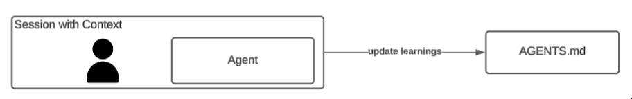
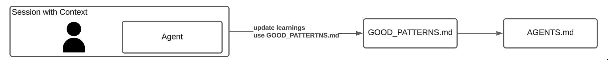
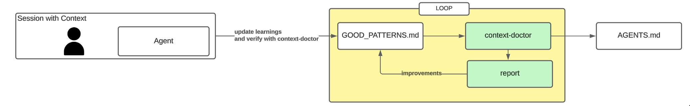
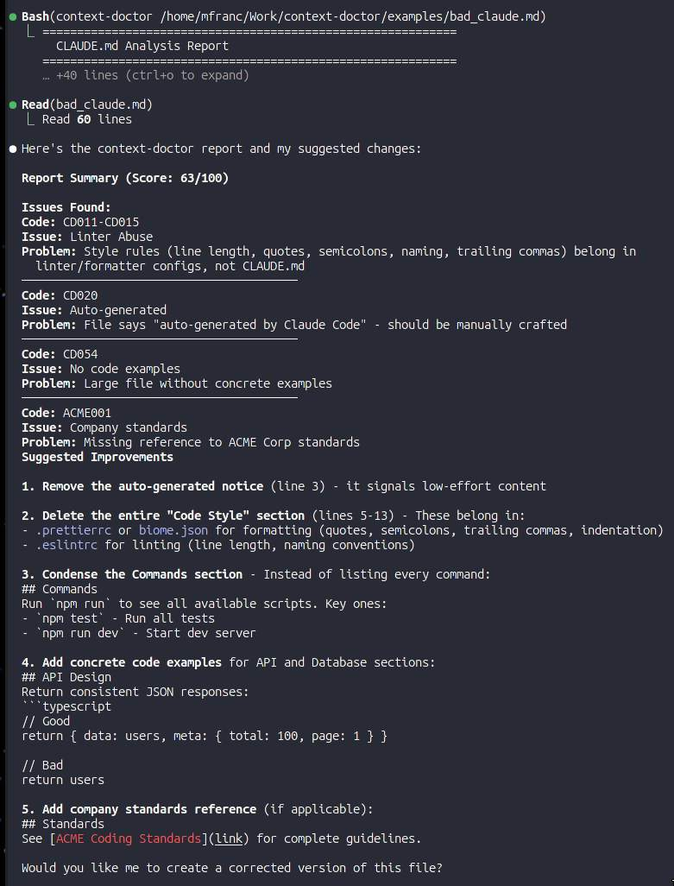

<p align="center">
  
</p>

# context-doctor

A CLI tool that analyzes context files (CLAUDE.md, AGENTS.md) and provides feedback on best practices for AI coding agent context management.

## Why this matters

When working with AI coding agents, your context grows throughout a session. It's tempting to tell the agent to update your context file with learnings so future sessions start with a better foundation. But this often leads to bloated files with conflicting instructions.

Supported context files:

- **CLAUDE.md** — Claude Code
- **AGENTS.md** — Codex CLI

Your initial context file instructions are **critical** for two reasons:

1. **Instruction count affects performance** - LLMs can reliably follow ~150-200 instructions. Claude Code's system prompt already uses [~50 instructions](https://www.humanlayer.dev/blog/writing-a-good-claude-md) according to HumanLayer's analysis. Every instruction you add competes for attention, and as count increases, compliance decreases uniformly across all instructions.

2. **Position matters** - Due to the ["Lost in the Middle"](https://arxiv.org/abs/2307.03172) phenomenon, LLMs exhibit a U-shaped attention curve: they best recall information at the **beginning** and **end** of context, while information in the middle gets overlooked. Your context file sits at the beginning - make every line count.

context-doctor helps you maintain a lean, effective context file by detecting common anti-patterns before they degrade your agent's performance.

## The problem

There are three approaches to maintaining your CLAUDE.md:

### 1. Unsupervised agent updates

Telling the agent "update CLAUDE.md with what you learned" leads to files that grow chaotically — instructions pile up, rules conflict, and generic advice dilutes project-specific guidance.



### 2. Using custom prompts

A [custom prompt for updating CLAUDE.md](https://www.aihero.dev/a-complete-guide-to-agents-md) (Matt Pocock's approach) helps, but requires you to remember to use it every time.



### 3. Using context-doctor (self-reinforcing loop)

context-doctor provides a standalone binary with 36 built-in rules (based on research and best practices) that evaluates your context file and suggests specific changes.



Tell the agent to run context-doctor itself, creating a self-reinforcing loop:

```
> Run context-doctor on CLAUDE.md and fix any issues it finds
```

The agent runs the analysis, reads the report, and applies fixes — all validated against the same rules. Run it periodically or add it to your CI pipeline.

## Example Output



<details>
<summary>Text output</summary>

Analyzing a context file with issues:

```
============================================================
  Context File Analysis Report
============================================================

File: examples/bad_claude.md

METRICS
----------------------------------------
  Lines:        60 (OK)
  Instructions: ~37 (+50 Claude = ~87) (OK)
  Progressive Disclosure: NO

LINTER ABUSE DETECTED
----------------------------------------
  ⚠ [CD011] Line length rules detected
     → Use a linter for line length enforcement
  ⚠ [CD012] Quote style rules detected
     → Use a formatter (Prettier, Biome) for quote style
  ⚠ [CD013] Naming convention rules detected
     → Use a linter for naming conventions
  ⚠ [CD014] Semicolon rules detected
     → Use a formatter for semicolon style
  ⚠ [CD015] Trailing character rules detected
     → Use a formatter for trailing characters

AUTO-GENERATED CONTENT
----------------------------------------
  ⚠ [CD020] File appears to be auto-generated
     → Your context file is high-leverage. Carefully craft each line manually instead of using /init

DIMENSION SCORES
----------------------------------------
  Correctness   [████████████████████] 100/100
  Style         [██████░░░░░░░░░░░░░░]  30/100
  Compliance    [████████████████████] 100/100
  Freshness     [████████████████████] 100/100

OVERALL SCORE
----------------------------------------
  [█████████████░░░░░░░] 65/100
```

Analyzing a well-crafted context file:

```
============================================================
  Context File Analysis Report
============================================================

File: examples/good_claude.md

METRICS
----------------------------------------
  Lines:        25 (OK)
  Instructions: ~6 (+50 Claude = ~56) (OK)
  Progressive Disclosure: YES

GOOD PRACTICES DETECTED
----------------------------------------
  ✓ [CD040] Progressive disclosure pattern detected

REFERENCED DOCS
----------------------------------------
  ✓ docs/architecture.md (last updated 5 days ago)
  ✓ docs/api-patterns.md (last updated 12 days ago)
  ✓ docs/testing.md (last updated 3 days ago)

DIMENSION SCORES
----------------------------------------
  Correctness   [████████████████████] 100/100
  Style         [██████████████████░░]  90/100
  Compliance    [████████████████████] 100/100
  Freshness     [████████████████████] 100/100

OVERALL SCORE
----------------------------------------
  [███████████████████░] 95/100

  ✓ Excellent! Your context file follows best practices.
```

</details>

## Installation

### Download binary (recommended)

Download the latest release for your platform from [GitHub Releases](https://github.com/michal-franc/context-doctor/releases).

**Linux (amd64):**
```bash
curl -Lo context-doctor https://github.com/michal-franc/context-doctor/releases/latest/download/context-doctor-linux-amd64
chmod +x context-doctor
sudo mv context-doctor /usr/local/bin/
```

**Linux (arm64):**
```bash
curl -Lo context-doctor https://github.com/michal-franc/context-doctor/releases/latest/download/context-doctor-linux-arm64
chmod +x context-doctor
sudo mv context-doctor /usr/local/bin/
```

**macOS (Apple Silicon):**
```bash
curl -Lo context-doctor https://github.com/michal-franc/context-doctor/releases/latest/download/context-doctor-darwin-arm64
chmod +x context-doctor
sudo mv context-doctor /usr/local/bin/
```

**macOS (Intel):**
```bash
curl -Lo context-doctor https://github.com/michal-franc/context-doctor/releases/latest/download/context-doctor-darwin-amd64
chmod +x context-doctor
sudo mv context-doctor /usr/local/bin/
```

**Windows:**

Download `context-doctor-windows-amd64.exe` from [releases](https://github.com/michal-franc/context-doctor/releases) and add to your PATH.

### From source

Requires Go 1.21+.

```bash
git clone https://github.com/michal-franc/context-doctor.git
cd context-doctor
make build
```

### Install to system (requires sudo)

```bash
sudo make install
```

### Install to user directory (no sudo)

```bash
make install-user
```

Make sure `~/go/bin` is in your PATH.

## Usage

```bash
context-doctor [options] <path-to-context-file | directory>
```

### Options

| Flag | Description |
|------|-------------|
| `-rules-dir` | Directory containing custom rules (default: same directory as context file) |
| `-no-builtin` | Disable built-in rules |
| `-verbose` | Show detailed output including passed checks |
| `-score` | Show overall score (default: true) |
| `-categories` | Filter by categories (comma-separated) |
| `-severities` | Filter by severities: error, warning, info (comma-separated) |
| `-stale-threshold` | Days before a referenced doc is considered stale (default: 90) |
| `-version` | Show version information |

### Example

```bash
# Analyze a single context file
context-doctor ./CLAUDE.md

# Scan an entire repository
context-doctor .

# Verbose output with all checks
context-doctor -verbose ./CLAUDE.md

# Only show errors
context-doctor -severities error ./CLAUDE.md
```

### Repository mode

When you pass a directory, context-doctor finds all context files (respecting `.gitignore`) and produces a consolidated repo report:

- Enforces a single context file per repo (multiple files = error with -30 score penalty)
- Validates referenced docs exist and aren't stale
- Recursively follows references (docs referencing other docs), with cycle detection
- Finds orphan `.md` files not referenced by any context file
- Detects duplicated instructions across the full file tree
- Shows aggregate metrics and per-file scores

### Primary vs referenced docs

context-doctor treats your context file and its referenced docs differently. Context-file-specific rules (line count limits, instruction count, missing project context, etc.) only run against the primary file — not against referenced docs like README.md or docs/*.md. Referenced docs serve humans too, so only universal rules (like linter abuse detection) apply to them.

See [RULES.md](RULES.md) for which rules are primary-only.

### Using with AI agents

Add to your CLAUDE.md or run interactively:

```
> Run context-doctor on CLAUDE.md and fix any issues it finds
```

## What it checks

- **Length issues** — File and line count thresholds
- **Instruction count** — Too many instructions reduce LLM compliance
- **Linter abuse** — Rules that should be handled by formatters/linters
- **Auto-generated content** — Detects `/init` generated files
- **Progressive disclosure** — Encourages linking to separate docs
- **Referenced docs** — Recursively validates referenced files exist and aren't stale
- **Cross-file consistency** — Detects duplicated instructions across the full reference tree
- **Staleness detection** — Scope-aware tracking: flags context files that haven't been updated while their directory scope has active commits
- **Stack detection** — Auto-detects Go, Python, Node.js, TypeScript, Rust, Make, Docker, GitHub Actions; suggests missing stack-specific content
- **Template suggestions** — When no context file exists, suggests a starter template based on detected stacks
- **Repo-level checks** — Enforces single context file per repo, finds orphan `.md` files

### Dimension scores

context-doctor scores your context file across four dimensions:

| Dimension | Weight | What it measures |
|-----------|--------|------------------|
| Correctness | 40% | Structural issues (length, instruction count, broken refs) |
| Style | 20% | Linter abuse, auto-generated content, generic advice |
| Compliance | 20% | Best practices (progressive disclosure, negative instructions, code examples) |
| Freshness | 20% | How recently the context file was updated in git |

See [RULES.md](RULES.md) for the complete list of 36 built-in rules.

## Custom Rules

Place custom rule YAML files in a `.context-doctor/` directory or specify a custom directory with `-rules-dir`.

```yaml
version: "1.0"
rules:
  - code: CUSTOM001
    description: Require API documentation reference
    severity: warning
    category: project-standards
    primaryOnly: true
    matchSpec:
      action: regexNotMatch
      patterns:
        - "(?i)api.*(doc|reference|spec)"
    errorMessage: "No API documentation reference found"
    suggestion: "Add a reference to your API docs (e.g., 'For API details, see docs/api.md')"
```

See [RULES.md](RULES.md) for the full reference and custom rule authoring guide.

## License

MIT
